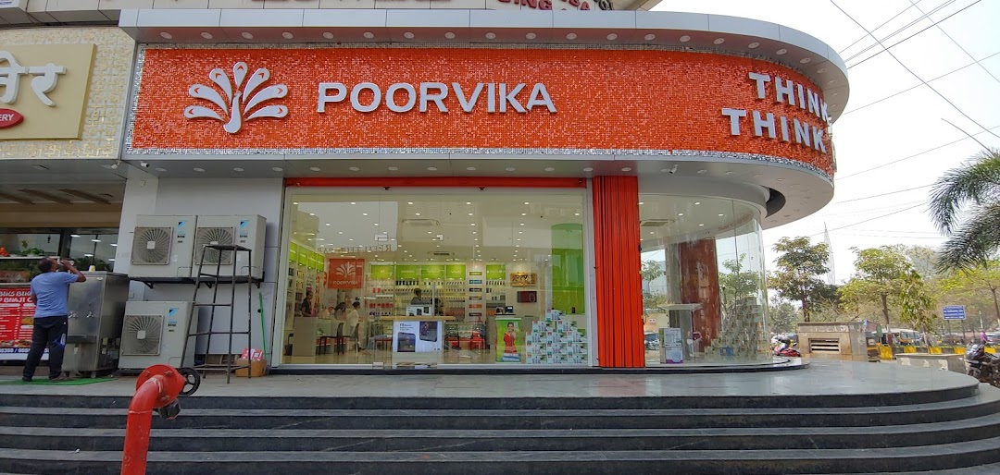

<!DOCTYPE html>
<html>
<head>
<meta name="viewport" content="width=device-width, initial-scale=1">
<link rel="stylesheet" href="style1.css"><!--external css-->  
<!--internal css-->  

</head>
<body>

 </a>
  

    <ul>
      <li><a href="#home">Home</a></li>
      <li class="dropdown">
        <a href="javascript:void(0)" class="dropbtn">Service</a>
        

          <a href="#">Repairs</a>
          <a href="#">Water damage</a>
          <a href="#">Display repairs</a>
        

      </li>
      <li><a href="#news">News</a></li>
      
    </ul>
    

  

<h2 style="color:orange">ABOUT US</h2> <!---inline css-->
<h3 >
  Poorvika is the Largest Tech Retailer in India, spanning across 460+ showrooms in and around Tamil Nadu, Karnataka, Pondicherry, Mumbai, Pune and Trivandrum, famous for their touch & feel experience. Poorvika sells a wide category of devices in its showrooms and Online portal, ranging from the Best Smartphones, Laptops, Computers, Smart Devices, Smart TVs to Accessories. Poorvika's E-Commerce platform www.poorvika.com caters to customers across India where Customers can Comfortably Order their devices with just a tap and get them delivered Safely with delivery options such as 2 Hours Delivery, Same Day Delivery, Next Day Delivery, and a Pickup at the Store option based on their location. Having served over 5 Crore+ Happy Customers, Poorvika takes pride in being India's leading retailer for Top Brands like Apple, Samsung, Oppo, Vivo, Xiaomi, OnePlus, Redmi, Realme, Nokia, etc.
</h3>
<h2 style="color:orange">THE SECRET BEHIND OUR SUCCESS</h2> <!---inline css-->
<h3>Customer Satisfaction and Upholding their Trust has always been the priority for the Poorvika Brand. It is this Mission & Vision that all Poorvikans work towards, ensuring the highest standards of quality across all Poorvika Platforms, and there is no doubt that Poorvika will soon be the No.1 Online Retailer in the Country.</h3>

</html>
